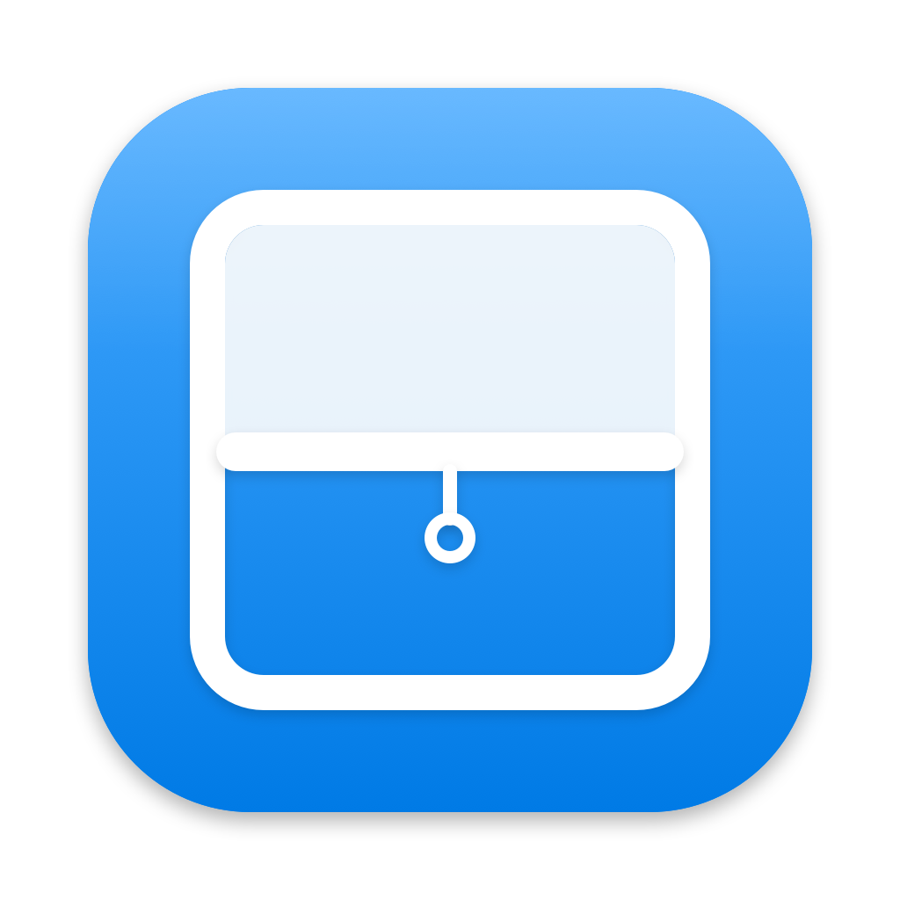

<p align="center"></p>

# Blinds

*Traduzione italiana. La versione principale, in inglese, è [README.md](README.md).*

Piccola app per la barra dei menu del Mac: nasconde le icone che scegli tu e le mostra con un clic. Sostituisce Hidden Bar (e Ice), che su macOS 27 non funzionano più.

Nelle prime due versioni Blinds si chiamava Tendina. Installando Blinds, Tendina viene sostituita e le sue impostazioni restano.

## Installare

Tre strade, scegline una. Tutte compilano l'app sul tuo Mac: per questo non serve una firma Apple e non compare nessun avviso di sicurezza.

Serve un Mac con Apple Silicon e gli strumenti di sviluppo di Apple. Se non li hai, si installano gratis con `xcode-select --install`.

### 1. Un solo comando

```sh
curl -fsSL https://raw.githubusercontent.com/massimodascola/blinds/master/install.sh | sh
```

Scarica il codice, lo compila, copia Blinds in Applicazioni e la avvia. Per aggiornarla, rilancia lo stesso comando. Lo script è [install.sh](install.sh): leggilo prima, se vuoi sapere cosa fa.

### 2. Homebrew

```sh
brew install massimodascola/tap/blinds
blinds-install
```

Homebrew compila Blinds, ma non può copiare app in Applicazioni da solo: lo fa il comando `blinds-install`. Per aggiornarla:

```sh
brew upgrade blinds && blinds-install
```

### 3. Dal codice

```sh
git clone https://github.com/massimodascola/blinds.git
cd blinds
sh build.sh --install
```

Per aggiornarla, dalla cartella `blinds`: `git pull && sh build.sh --install`. Senza `--install`, `build.sh` compila soltanto in `build/Blinds.app`.

### Disinstallare

Dal menu di Blinds togli la spunta "Apri all'accensione del Mac", poi "Esci da Blinds", poi cestina `/Applications/Blinds.app`. Se l'hai installata con Homebrew, anche `brew uninstall blinds`.

## Come si usa

* **Scegliere cosa nascondere**: tieni premuto ⌘ e trascina nella barra le icone da nascondere, mettendole **a sinistra della lineetta │**. Quelle a destra della freccia restano sempre visibili.
* **Aprire e chiudere**: clic sulla freccia. `‹` vuol dire "ci sono icone nascoste", `›` vuol dire "è tutto aperto".
* **Da tastiera**: ⌃⌥⌘B (control, option, comando, B).
* **Opzioni**: clic destro sulla freccia.
  * Richiudi da sola dopo 10 secondi (attiva di serie). Aspetta se hai un menu aperto o il mouse sulla barra.
  * Apri all'accensione del Mac.
  * Come si usa, Esci da Blinds.

Quando Blinds è chiusa la lineetta non si vede: per spostare altre icone, prima aprila.

L'app è in inglese, con la traduzione italiana che macOS sceglie da solo se il Mac è impostato in italiano.

## Come funziona

Su macOS 27 Apple ha rifatto la barra dei menu: le icone le disegna un processo di sistema (MenuBarAgent) e non sono più finestre separate. Hidden Bar allargava un suo separatore a 10.000 punti per spingere le altre icone fuori dallo schermo. Ora macOS scarta un'icona così larga, e il trucco non funziona più.

Misure fatte il 23/09/2026 su un MacBook Pro 14" con tacca, macOS 27.0 (build 26A428), schermo da 1800 punti:

* quando un'icona non ci sta, macOS la mette nel suo menu di troppo pieno (la freccia « di sistema) **insieme a tutte le icone alla sua sinistra**, senza lasciare buchi;
* un'icona larga 850 punti viene gestita così, una da 950 punti viene scartata e ignorata. La soglia è circa metà dello schermo.

Blinds quindi allarga la lineetta al 44% della larghezza dello schermo più stretto (792 punti su quel Mac): troppo larga per starci, ma sotto la soglia. La lineetta e tutto quello che ha a sinistra spariscono. Per mostrare, torna larga 10 punti.

Su macOS 26 e precedenti le icone sono ancora finestre separate. Lì Blinds usa il metodo classico di Hidden Bar e Ice: separatore largo 10.000 punti, che spinge fuori dallo schermo tutto quello che ha a sinistra.

Usa solo funzioni pubbliche di Apple: nessun permesso di Accessibilità, di registrazione schermo o di monitoraggio input. La scorciatoia usa l'API Carbon, vecchia ma l'unica che non chiede permessi.

## Compatibilità

* **macOS 27**: provata (MacBook Pro con tacca, macOS 27.0).
* **macOS 13 fino a 26**: dovrebbe funzionare con il metodo classico, ma **non è provata**. Se la usi su una di queste versioni, una segnalazione nelle issue è preziosa, anche solo per dire che funziona.

## Limiti noti

* **Barra piena**: sui Mac con la tacca, a destra della tacca c'è posto per circa 790 punti di icone. Se con Blinds aperta le icone non ci stanno tutte, macOS mette quelle più a sinistra nella sua « come sempre.
* **Schermi esterni**: non provato. Su uno schermo largo, con molto spazio libero, le icone nascoste potrebbero ricomparire.
* **Solo Mac con Apple Silicon** (`arm64`). Per un Mac Intel va cambiato il `-target` in `build.sh`.
* La firma è "ad hoc", fatta sul Mac che compila. Non c'è una versione già pronta da scaricare.

## Se si rompe

* **La freccia è sparita**: premi ⌃⌥⌘B, oppure riapri Blinds da Spotlight (riaprirla mostra tutto). Poi controlla che la lineetta sia a sinistra della freccia.
* **Non nasconde niente**: apri Blinds e controlla che le icone da nascondere siano a sinistra della lineetta. Se Blinds trova la lineetta a destra della freccia, non chiude e lo dice.
* **Dopo un aggiornamento di macOS smette di funzionare**: probabilmente Apple ha cambiato la soglia di larghezza (vale per macOS 27 e successivi). Prova a cambiare `0.44` in `collapsedDividerWidth()` dentro `Sources/Blinds.swift` (più basso se le icone ricompaiono), poi `sh build.sh --install`.
* **Hidden Bar e Blinds insieme** si pestano i piedi: tenerne attiva una sola.

## File

* `Sources/Blinds.swift`: tutto il programma (un solo file, commentato, in inglese).
* `Resources/Info.plist`: nome, identificativo e niente icona nel Dock. L'identificativo è ancora `com.massimodascola.tendina`, della prima versione, così macOS conserva posizioni delle icone e impostazioni.
* `Resources/en.lproj`, `Resources/it.lproj`: i testi dell'app in inglese (predefinito) e in italiano.
* `Resources/Blinds.icns`, `Resources/icon.png`: l'icona, una finestra con la tendina abbassata sul blu di sistema di macOS 27 (`#0088FF`).
* `tools/draw-icon.swift`, `tools/make-icon.sh`: disegnano l'icona e la convertono. Servono solo se si cambia il disegno.
* `Resources/logo/`: il kit del logo (simbolo a colori, simbolo nero e bianco, logo per sfondi chiari e scuri), in SVG e PNG. Lo genera `tools/make-logo-kit.swift`; il nome è scritto in [Inter](https://github.com/rsms/inter) (licenza SIL Open Font License 1.1).
* `build.sh`: compila, firma e installa.
* `install.sh`: installazione con un solo comando (scarica il codice e lancia `build.sh`).
* La formula Homebrew sta in un repo a parte: [massimodascola/homebrew-tap](https://github.com/massimodascola/homebrew-tap).

## Autore e licenza

Creata da **Massimo D'Ascola** ([@massimodascola](https://github.com/massimodascola)). Licenza MIT: puoi usarla, modificarla e ridistribuirla, mantenendo la nota sull'autore (vedi `LICENSE`).

Sperimentale: provata solo su un MacBook Pro con tacca e macOS 27.0. Segnalazioni e correzioni sono benvenute nelle issue.
