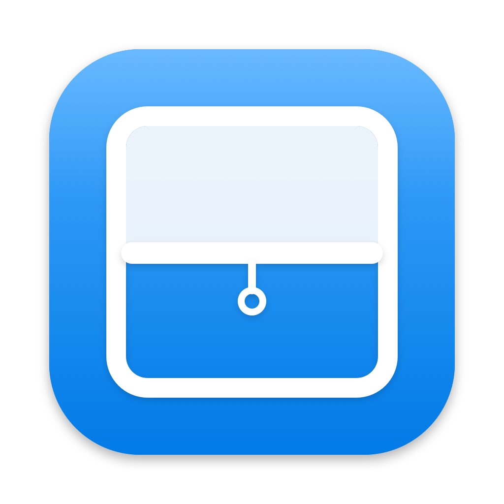

<p align="center"></p>

# Tendina

*English version: [README.en.md](README.en.md)*

Piccola app per la barra dei menu del Mac: nasconde le icone che scegli tu e le mostra con un clic. Sostituisce Hidden Bar, che su macOS 27 non funziona più.

## Come si usa

* **Scegliere cosa nascondere**: tieni premuto ⌘ e trascina nella barra le icone da nascondere, mettendole **a sinistra della lineetta │**. Quelle a destra della freccia restano sempre visibili.
* **Aprire e chiudere**: clic sulla freccia. `‹` vuol dire "ci sono icone nascoste", `›` vuol dire "è tutto aperto".
* **Da tastiera**: ⌃⌥⌘B (control, option, comando, B).
* **Opzioni**: clic destro sulla freccia.
  * Richiudi da sola dopo 10 secondi (attiva di serie). Aspetta se hai un menu aperto o il mouse sulla barra.
  * Apri all'accensione del Mac.
  * Come si usa, Esci.

Quando la tendina è chiusa la lineetta non si vede: per spostare altre icone, prima aprila.

## Installare o aggiornare

Serve Xcode (o i Command Line Tools) già installato.

```sh
sh build.sh --installa
```

Compila in `build/Tendina.app`, la copia in `/Applications` e la avvia. Senza `--installa` compila soltanto.

## Come funziona

Su macOS 27 Apple ha rifatto la barra dei menu: le icone le disegna un processo di sistema (MenuBarAgent) e non sono più finestre separate. Hidden Bar allargava un suo separatore a 10.000 punti per spingere le altre icone fuori dallo schermo. Ora macOS scarta un'icona così larga, e il trucco non funziona più.

Misure fatte su questo Mac il 23/09/2026 (macOS 27.0, build 26A428, schermo da 1800 punti):

* quando un'icona non ci sta, macOS la mette nel suo menu di troppo pieno (la freccia « di sistema) **insieme a tutte le icone alla sua sinistra**, senza lasciare buchi;
* un'icona larga 850 punti viene gestita così, una da 950 punti viene scartata e ignorata. La soglia è circa metà dello schermo.

Tendina quindi allarga la lineetta al 44% della larghezza dello schermo più stretto (792 punti su questo Mac): troppo larga per starci, ma sotto la soglia. La lineetta e tutto quello che ha a sinistra spariscono. Per mostrare, torna larga 10 punti.

Su macOS 26 e precedenti le icone sono ancora finestre separate. Lì Tendina usa il metodo classico di Hidden Bar e Ice: separatore largo 10.000 punti, che spinge fuori dallo schermo tutto quello che ha a sinistra.

Usa solo funzioni pubbliche di Apple: nessun permesso di Accessibilità, di registrazione schermo o di monitoraggio input. La scorciatoia usa l'API Carbon, vecchia ma l'unica che non chiede permessi.

## Compatibilità

* **macOS 27**: provata (MacBook Pro con tacca, macOS 27.0).
* **macOS 13 fino a 26**: dovrebbe funzionare con il metodo classico, ma **non è provata**. Se la usi su una di queste versioni, una segnalazione nelle issue è preziosa, anche solo per dire che funziona.

## Limiti noti

* **Barra piena**: il Mac ha la tacca, e a destra della tacca c'è posto per circa 790 punti di icone. Se a tendina aperta le icone non ci stanno tutte, macOS mette quelle più a sinistra nella sua « come sempre.
* **Schermi esterni**: non provato. Su uno schermo largo, con molto spazio libero, le icone nascoste potrebbero ricomparire.
* **Solo Mac con Apple Silicon** (`arm64`). Per un Mac Intel va cambiato il `-target` in `build.sh`.
* La firma è "ad hoc", valida solo su questo Mac. Non è pensata per essere distribuita.

## Se si rompe

* **La freccia è sparita**: premi ⌃⌥⌘B, oppure riapri Tendina da Spotlight (riaprirla mostra tutto). Poi controlla che la lineetta sia a sinistra della freccia.
* **Non nasconde niente**: apri la tendina e controlla che le icone da nascondere siano a sinistra della lineetta. Se Tendina trova la lineetta a destra della freccia, non chiude e lo dice.
* **Dopo un aggiornamento di macOS smette di funzionare**: probabilmente Apple ha cambiato la soglia di larghezza (vale per macOS 27 e successivi). Prova a cambiare `0.44` in `larghezzaChiusa()` dentro `Sources/Tendina.swift` (più basso se l'icona viene scartata e le icone ricompaiono), poi `sh build.sh --installa`.
* **Hidden Bar e Tendina insieme** si pestano i piedi: tenerne attiva una sola.
* **Per disinstallare**: dal menu togli la spunta "Apri all'accensione", poi Esci, poi cestina `/Applications/Tendina.app`.

## Autore e licenza

Creata da **Massimo D'Ascola** ([@massimodascola](https://github.com/massimodascola)). Licenza MIT: puoi usarla, modificarla e ridistribuirla, mantenendo la nota sull'autore (vedi `LICENSE`).

Sperimentale: provata solo su un MacBook Pro con tacca e macOS 27.0. Segnalazioni e correzioni sono benvenute nelle issue.

## File

* `Sources/Tendina.swift`: tutto il programma (un solo file, commentato).
* `Resources/Info.plist`: nome, identificativo `com.massimodascola.tendina`, niente icona nel Dock.
* `Resources/Tendina.icns`, `Resources/icona.png`: l'icona, una finestra con la tendina abbassata sul blu di sistema di macOS 27 (`#0088FF`).
* `tools/disegna-icona.swift`, `tools/crea-icona.sh`: disegnano l'icona e la convertono. Servono solo se si cambia il disegno.
* `build.sh`: compila, firma e installa.
